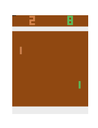

# CNN-DQN-KAN for Atari Games

Deep Q-Networks (DQN) is a reinforcement learning algorithm that combines Q-learning with artificial neural networks. It offers an effective way to handle complex environments such as Atari games. DQN is a strong alternative to conventional Q-learning, with the ability to learn from high-dimensional visual representations using deep neural networks.

In this project, I attempt to evaluate the performance of Kolmogorov Arnold Networks (KAN) when combined with CNN-DQN for Atari games. KAN is an alternative to the Multi-Layer Perceptron (MLP) that can be applied to various neural network architectures as a substitute for MLP. In this code, I created four combinations as follows:

1. **CNN-DQN-MLP (ReLU)**: The fully connected layer uses MLP with ReLU activation function.
2. **CNN-DQN-KAN (ReLU)**: The fully connected layer uses KAN with ReLU activation function.
3. **CNN-DQN-MLP (SELU)**: The fully connected layer uses MLP with SELU activation function.
4. **CNN-DQN-KAN (SELU)**: The fully connected layer uses KAN with SELU activation function (Best Result).

This code is designed to be run on Kaggle, with the original source code from [this Kaggle link](https://www.kaggle.com/code/kingjuno/dqn-atari-pytorch). CNN-DQN-KAN code is developed from [this repository](https://github.com/jakariaemon/CNN-KAN).

Training results:

GIF Results:
1. **gym_animation-mlp**

   

2. **gym_animation-kan-relu**

   

3. **gym_animation-kan-selu**

   

## Comparison Analysis

**Note:** All models were trained only once, except for the CNN DQN - MLP (SELU) model, which was trained twice to ensure no performance change. The SELU activation function was used without LeCun initialization. These results are just for fun, not a serious experiment. :D

1. **Reward Performance:**
   - **DQN-MLP (ReLU):** Showed good and stable rewards around the value 18.
   - **DQN-KAN (SELU) and DQN-KAN (ReLU):** Showed good rewards but required longer training time than DQN-MLP.
   - **DQN-MLP (SELU):** Showed less stable rewards with significant fluctuations.

2. **Training Time:**
   - **DQN-MLP (ReLU) and DQN-MLP (SELU):** Required shorter training time than DQN-KAN.
   - **DQN-KAN (ReLU and SELU):** Required longer training time but showed more stable results.

3. **Model Size:**
   - **DQN-KAN:** Model size is much larger (~61.8 MB) compared to DQN-MLP (~6 MB).

   The larger model size of DQN-KAN provides more complex modeling capabilities but requires greater computational resources.

4. **Loss Stability:**
   - All models showed a rapid decrease in loss values in the early stages of training and stabilized at low values after 200,000 frames.
   - **DQN-MLP (SELU):** Showed significant loss increases at certain points, indicating instability.

5. **Conclusion:**
   - **DQN-MLP (ReLU):** An efficient choice with shorter training time and smaller model size, showing good and stable reward performance.
   - **DQN-KAN (ReLU and SELU):** Although requiring longer training time and larger model size, provided good and stable reward results with higher computational costs.
   - **DQN-MLP (SELU):** Showed less stable and fluctuating rewards, indicating it may be less suitable for this task than other configurations.

This comparison demonstrates the trade-off between model complexity, training time, and the performance achieved. The right model choice depends on the specific application needs and available resources.

**For General Knowledge:**
Why are the training time and model size larger for the KAN combination? The KAN architecture uses edge activation functions that can be learned and adjusted during training, unlike MLP, which has fixed activation functions that cannot be learned.
