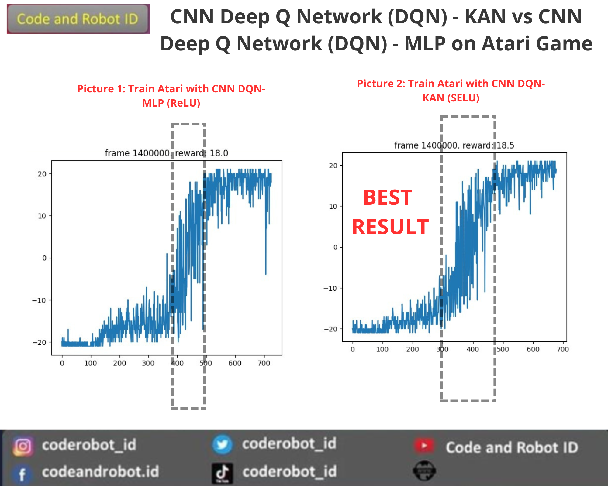
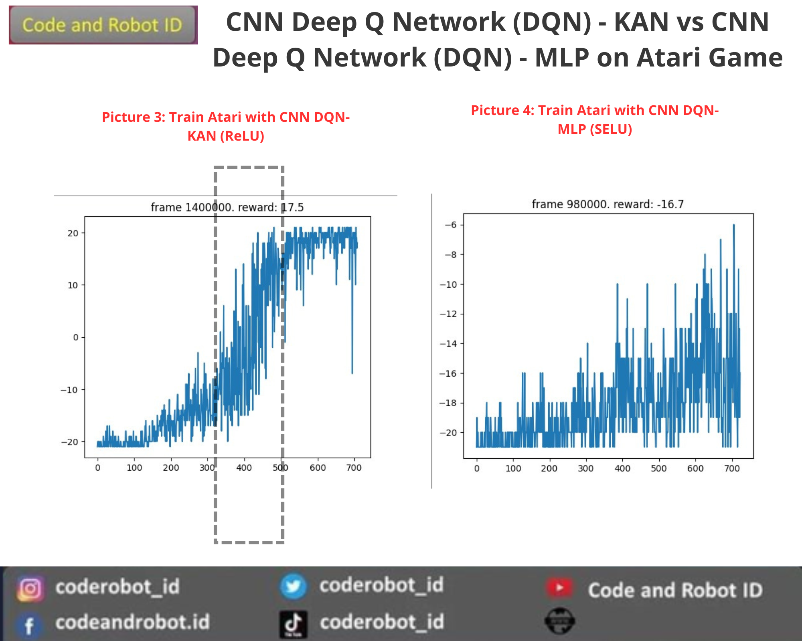
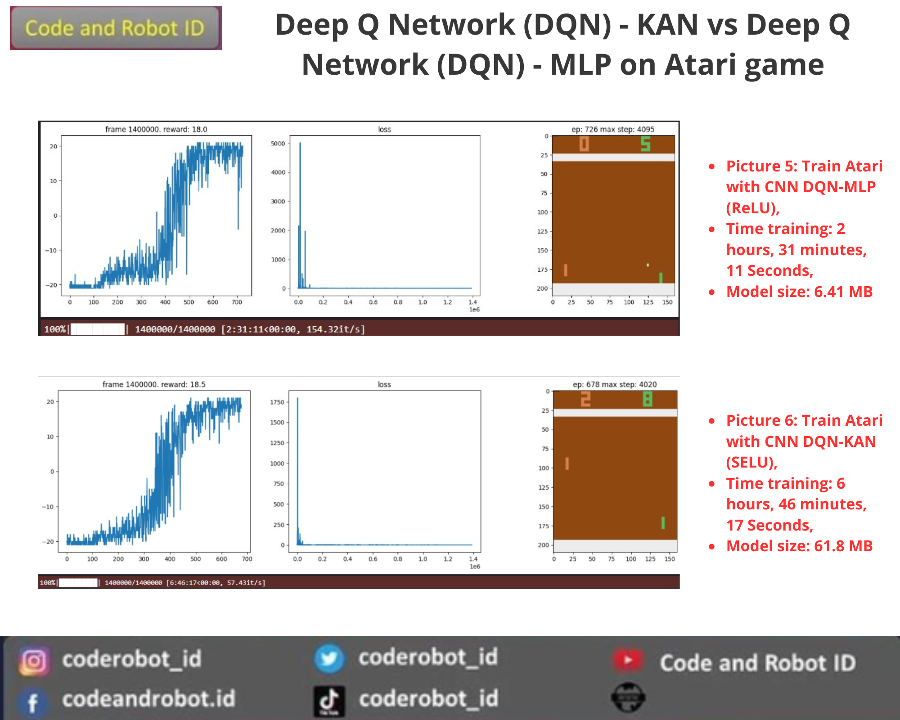
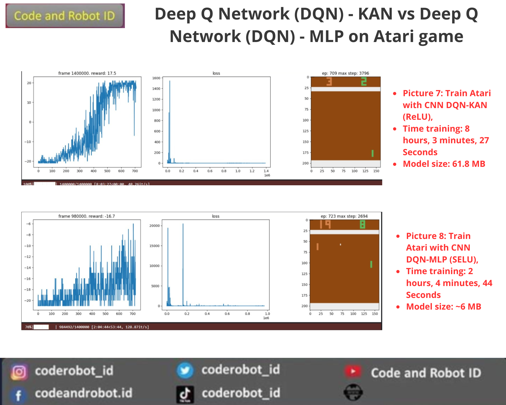
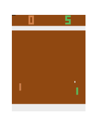

# CNN-DQN-KAN for Atari Games

Pada kode ini saya mencoba untuk melihat performa yang dihasilkan oleh Kolmogorov Arnold Networks (KAN) pada kombinasi CNN-DQN untuk kasus Game Atari. KAN adalah alternatif MLP dan dapat diterapkan pada berbagai arsitektur Neural Networks sebagai pengganti MLP. Jadi pada kode ini saya membuat 4 kombinasi yaitu:
1. CNN-DQN-MLP (ReLU) dimana Fully Connected Layer menggunakan MLP pada umunya dan fungsi aktivasi menggunakan ReLU.
2. CNN-DQN-KAN (ReLU) dimana Fully Connected Layer menggunakan KAN dan fungsi aktivasi menggunakan ReLU.
3. CNN-DQN-MLP (SELU) dimana Fully Connected Layer menggunakan MLP pada umunya dan fungsi aktivasi menggunakan SELU.
4. CNN-DQN-KAN (SELU) dimana Fully Connected Layer menggunakan KAN dan fungsi aktivasi menggunakan SELU (Hasil Terbaik).

Kode ini dikhususkan untuk dijalankan pada Kaggle dan juga sumber asli kode berasal dari link kaggle berikut https://www.kaggle.com/code/kingjuno/dqn-atari-pytorch. Pengembangan kode CNN-DQN-KAN dari repository berikut https://github.com/jakariaemon/CNN-KAN. 

Hasil plotting training:

Hasil gif

## Analisis Perbandingan

Note: Semua model hanya ditraining 1x dan pada model CNN DQN - MLP (SELU) ditraing 2x karena ingin memastikan apakah ada perubahan performa. Dan, untuk fungsi aktivasi SELU tanpa menggunakan inisialisasi LeCun (LeCun initialization). Hasil ini cuma buat gabut saja bukan eksperimen serius :D

1. Performa Reward:
- DQN-MLP (ReLU) menunjukkan hasil reward yang baik dan stabil pada nilai sekitar 18.
- DQN-KAN (SELU) dan DQN-KAN (ReLU) juga menunjukkan hasil reward yang baik, tetapi memerlukan waktu pelatihan yang lebih lama dibandingkan DQN-MLP.
- DQN-MLP (SELU) menunjukkan performa reward yang kurang stabil dengan fluktuasi yang signifikan.

2. Waktu Pelatihan:
- DQN-MLP (ReLU) dan DQN-MLP (SELU) memerlukan waktu pelatihan yang lebih singkat dibandingkan dengan DQN-KAN.
- DQN-KAN dengan kedua fungsi aktivasi (ReLU dan SELU) memerlukan waktu pelatihan yang lebih lama tetapi menunjukkan hasil yang lebih stabil.
Ukuran Model:
- DQN-KAN memiliki ukuran model yang jauh lebih besar (~61.8 MB) dibandingkan dengan DQN-MLP (~6 MB).

Ukuran model yang lebih besar pada DQN-KAN dapat memberikan kemampuan pemodelan yang lebih kompleks tetapi juga membutuhkan sumber daya komputasi yang lebih besar.

3. Stabilitas Loss:
- Semua model menunjukkan penurunan nilai loss yang cepat pada tahap awal pelatihan dan stabil pada nilai rendah setelah frame 200.000.
- DQN-MLP (SELU) menunjukkan peningkatan loss yang signifikan pada beberapa titik, menunjukkan adanya instabilitas.

4. Kesimpulan
- DQN-MLP (ReLU) adalah pilihan yang efisien dengan waktu pelatihan yang lebih singkat dan ukuran model yang lebih kecil, menunjukkan performa reward yang baik dan stabil.
- DQN-KAN baik dengan fungsi aktivasi ReLU maupun SELU, meskipun memerlukan waktu pelatihan yang lebih lama dan ukuran model yang lebih besar, memberikan hasil reward yang baik dan stabil, tetapi dengan biaya komputasi yang lebih tinggi.
- DQN-MLP (SELU) menunjukkan performa reward yang kurang stabil dan fluktuatif, menunjukkan bahwa mungkin kurang cocok untuk tugas ini dibandingkan dengan konfigurasi lainnya.

Perbandingan ini menunjukkan trade-off antara kompleksitas model, waktu pelatihan, dan performa yang dihasilkan. Pemilihan model yang tepat bergantung pada kebutuhan spesifik aplikasi dan sumber daya yang tersedia.

Buat pengetahuan bersama: 
Mengapa waktu training dan size model kombinasi KAN lebih besar? Karena arsitektur KAN menggunakan fungsi aktivasi tepi yang dapat dipelajari dan disesuaikan selama pelatihan. Berbeda dengan MLP yang memiliki fungsi aktivasi tetap dan tidak dapat dipelajari.
